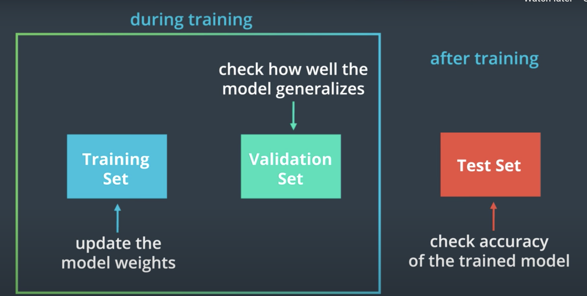

# MLP MNIST
https://keras.io/examples/mnist_mlp/

https://github.com/keras-team/keras/blob/master/examples/mnist_mlp.py
## Cross-Entropy Loss
In the PyTorch [documentation](https://pytorch.org/docs/stable/nn.html#crossentropyloss), you can see that the cross entropy loss function actually involves two steps:

- It first applies a softmax function to any output is sees
- Then applies [NLLLoss](https://pytorch.org/docs/stable/nn.html#nllloss); negative log likelihood loss
Then it returns the average loss over a batch of data. Since it applies a softmax function, we do not have to specify that in the forward function of our model definition, but we could do this another way.

### Another approach
We could separate the softmax and NLLLoss steps.

In the forward function of our model, we would explicitly apply a softmax activation function to the output, x.
```
# a softmax layer to convert 10 outputs into a distribution of class probabilities
x = F.log_softmax(x, dim=1)

return x
```
Then, when defining our loss criterion, we would apply NLLLoss
```
# cross entropy loss combines softmax and nn.NLLLoss() in one single class
# here, we've separated them
criterion = nn.NLLLoss()
```
This separates the usual criterion = nn.CrossEntropy() into two steps: softmax and NLLLoss, and is a useful approach should you want the output of a model to be class probabilities rather than class scores.
## Model.eval()
model.eval() will set all the layers in your model to evaluation mode. This affects layers like dropout layers that turn "off" nodes during training with some probability, but should allow every node to be "on" for evaluation. So, you should set your model to evaluation mode before testing or validating your model and set it to model.train() (training mode) only during the tr

## Dropou
[Dropout: A Simple Way to Prevent Neural Networks from
Overfitting](https://www.cs.toronto.edu/~hinton/absps/JMLRdropout.pdf)

## Commonly used activation functions
https://cs231n.github.io/neural-networks-1/#actfun

## Model Validation

- why not use test data for validation?
Even weights are not updated by validation data, but the model selection process is based on how model performs on both training and validation sets, so in the end the model is biased in favor of the validation set. Thus we need a separate test set of data to truly see how selected model generalize and performs when given never seen data.  
- Validation Set: Takeaways
We create a validation set to:
Measure how well a model generalizes, during training
Tell us when to stop training a model; when the validation loss stops decreasing (and especially when the validation loss starts increasing and the training loss is still decreasing)
- Find implementation in [github](https://github.com/udacity/deep-learning-v2-pytorch/blob/master/convolutional-neural-networks/mnist-mlp/mnist_mlp_solution_with_validation.ipynb)
