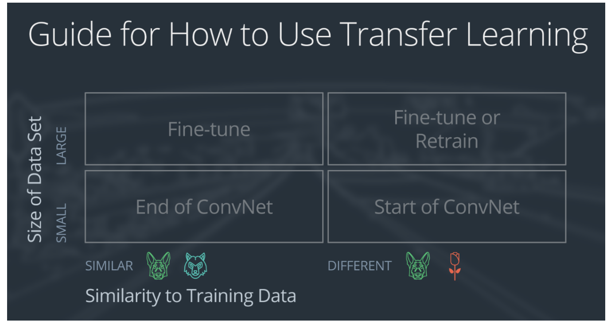
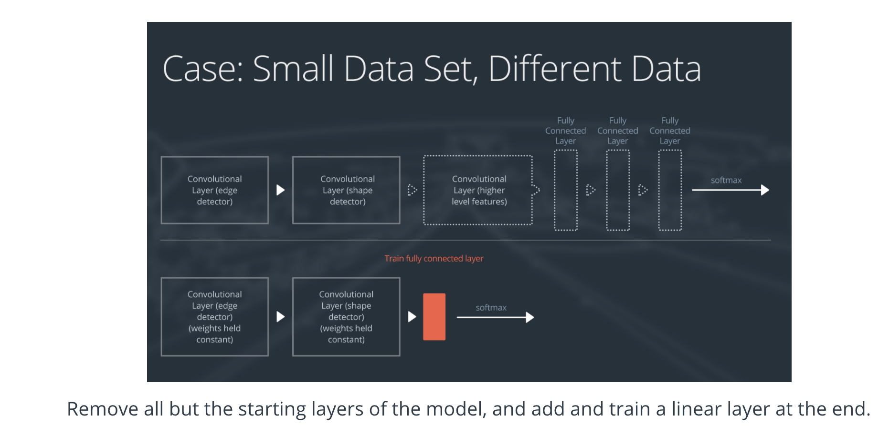
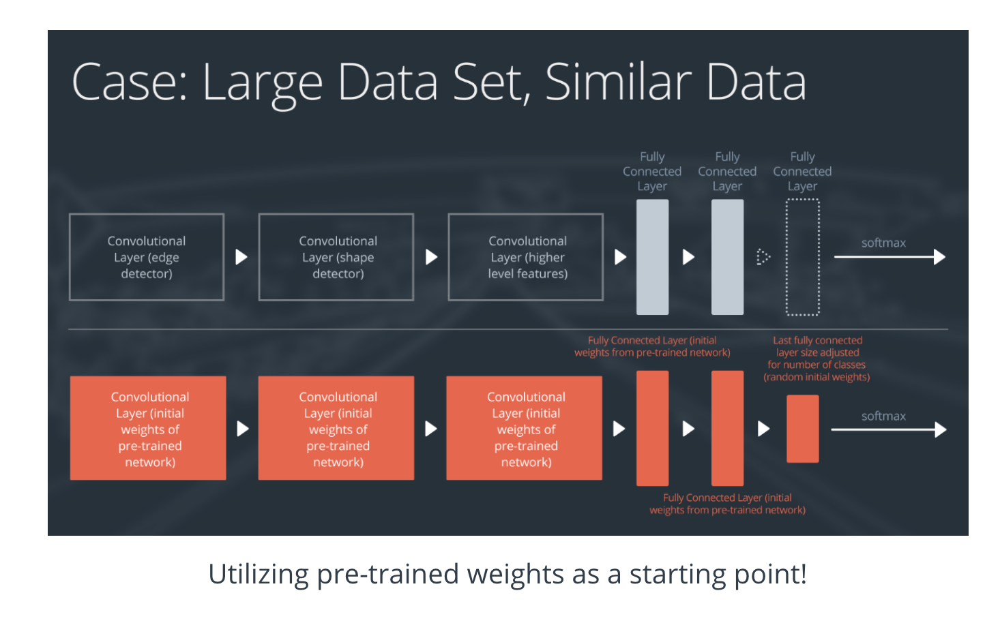
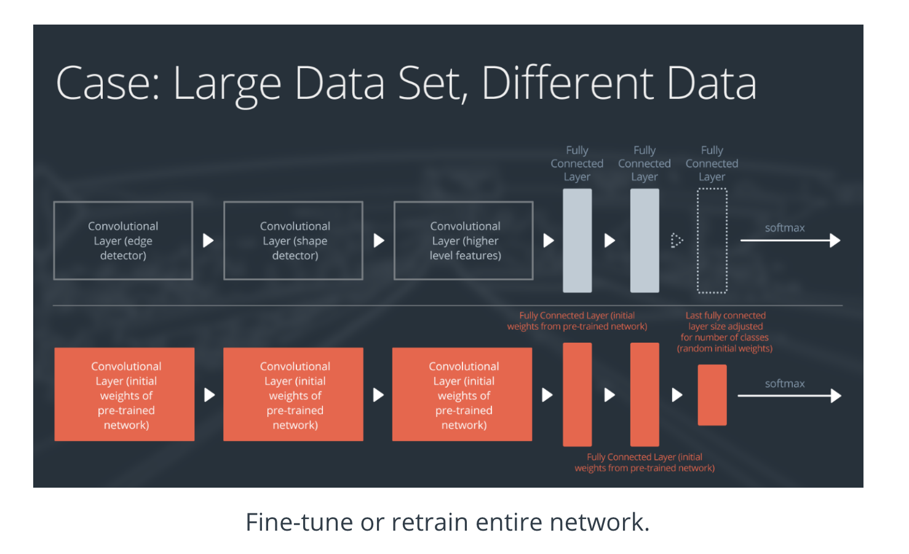

# Transfer learning
involves taking a pre-trained neural network and adapting the neural network to a new, different data set.

Depending on both:

- The size of the new data set, and
- The similarity of the new data set to the original data set
The approach for using transfer learning will be different. There are four main cases:

- New data set is small, new data is similar to original training data.
- New data set is small, new data is different from original training data.
- New data set is large, new data is similar to original training data.
- New data set is large, new data is different from original training data.

A large data set might have one million images. A small data could have two-thousand images. The dividing line between a large data set and small data set is somewhat subjective. Overfitting is a concern when using transfer learning with a small data set.

Images of dogs and images of wolves would be considered similar; the images would share common characteristics. A data set of flower images would be different from a data set of dog images.

Each of the four transfer learning cases has its own approach. In the following sections, we will look at each case one by one.

The graph below displays what approach is recommended for each of the four main case

## Case 1: Small Data Set, Similar Data

If the new data set is small and similar to the original training data:

slice off the end of the neural network
add a new fully connected layer that matches the number of classes in the new data set
randomize the weights of the new fully connected layer; freeze all the weights from the pre-trained network
train the network to update the weights of the new fully connected layer
To avoid overfitting on the small data set, the weights of the original network will be held constant rather than re-training the weights.

Since the data sets are similar, images from each data set will have similar higher level features. Therefore most or all of the pre-trained neural network layers already contain relevant information about the new data set and should be kept

## Case 2: Small Data Set, Different Data
If the new data set is small and different from the original training data:

slice off all but some of the pre-trained layers near the beginning of the network
add to the remaining pre-trained layers a new fully connected layer that matches the number of classes in the new data set
randomize the weights of the new fully connected layer; freeze all the weights from the pre-trained network
train the network to update the weights of the new fully connected layer
Because the data set is small, overfitting is still a concern. To combat overfitting, the weights of the original neural network will be held constant, like in the first case.

But the original training set and the new data set do not share higher level features. In this case, the new network will only use the layers containing lower level features.

Here is how to visualize this approach:

## Case 3: Large Data Set, Similar Data
If the new data set is large and similar to the original training data:

remove the last fully connected layer and replace with a layer matching the number of classes in the new data set
randomly initialize the weights in the new fully connected layer
initialize the rest of the weights using the pre-trained weights
re-train the entire neural network
Overfitting is not as much of a concern when training on a large data set; therefore, you can re-train all of the weights.

Because the original training set and the new data set share higher level features, the entire neural network is used as well.

Here is how to visualize this approach:

## Case 4: Large Data Set, Different Data
If the new data set is large and different from the original training data:

remove the last fully connected layer and replace with a layer matching the number of classes in the new data set
retrain the network from scratch with randomly initialized weights
alternatively, you could just use the same strategy as the "large and similar" data case
Even though the data set is different from the training data, initializing the weights from the pre-trained network might make training faster. So this case is exactly the same as the case with a large, similar data set.

If using the pre-trained network as a starting point does not produce a successful model, another option is to randomly initialize the convolutional neural network weights and train the network from scratch.

Here is how to visualize this approach:

## Papers
- Check out this research [paper-How transferable are features in deep neural networks?](https://arxiv.org/pdf/1411.1792.pdf) that systematically analyzes the transferability of features learned in pre-trained CNNs.
- Read the Nature publication detailing Sebastian Thrun's cancer-detecting CNN! [Dermatologist-level classification of skin cancer with deep neural networks](https://www.nature.com/articles/nature21056.epdf?referrer_access_token=_snzJ5POVSgpHutcNN4lEtRgN0jAjWel9jnR3ZoTv0NXpMHRAJy8Qn10ys2O4tuP9jVts1q2g1KBbk3Pd3AelZ36FalmvJLxw1ypYW0UxU7iShiMp86DmQ5Sh3wOBhXDm9idRXzicpVoBBhnUsXHzVUdYCPiVV0Slqf-Q25Ntb1SX_HAv3aFVSRgPbogozIHYQE3zSkyIghcAppAjrIkw1HtSwMvZ1PXrt6fVYXt-dvwXKEtdCN8qEHg0vbfl4_m&tracking_referrer=edition.cnn.com)

## useful layers
consider CNN & pooling layers as feature extractor , replace the fully connected layers and only train those layers. This is good if your data set is small, and image shapes are similar to the original dataset
## Fine tunning
if dataset is large, different from original dataset.
- random initialize the weights in the new fully connected layer
- initialize the rest of the weights using pre-trained weights
- re-train the entire neural network
