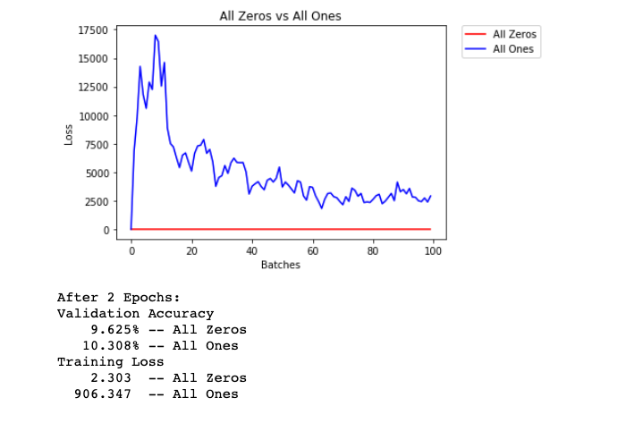
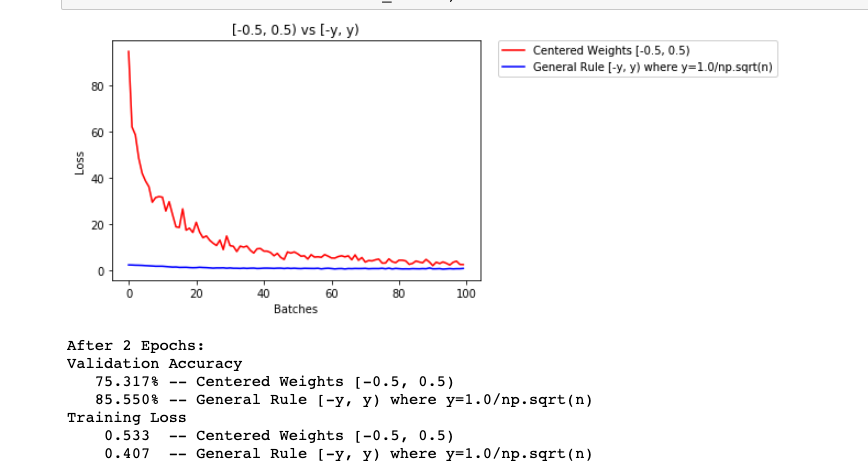

# research on weights
- Understanding the difficulty of training deep feedforward neural networks: http://proceedings.mlr.press/v9/glorot10a/glorot10a.pdf
- Delving Deep into Rectifiers: Surpassing Human-Level Performance on ImageNet Classification: https://arxiv.org/pdf/1502.01852v1.pdf
- Batch Normalization: Accelerating Deep Network Training by Reducing Internal Covariate Shift: https://arxiv.org/pdf/1502.03167v2.pdf

## constant weights

The neural network is having a hard time determining which weights need to be changed, since the neurons have the same output for each layer. To avoid neurons with the same output, let's use unique weights. We can also randomly select these weights to avoid being stuck in a local minimum for each run.

A good solution for getting these random weights is to sample from a uniform distribution.

## Uniform Distribution
A [uniform distribution](https://en.wikipedia.org/wiki/Uniform_distribution_(continuous%29) has the equal probability of picking any number from a set of numbers. We'll be picking from a continuous distribution, so the chance of picking the same number is low. We'll use NumPy's np.random.uniform function to pick random numbers from a uniform distribution.

np.random_uniform(low=0.0, high=1.0, size=None)
Outputs random values from a uniform distribution.

---
The loss graph is showing the neural network is learning, which it didn't with all zeros or all ones. We're headed in the right direction!

## General rule for setting weights
The general rule for setting the weights in a neural network is to set them to be close to zero without being too small.
>Good practice is to start your weights in the range of $[-y, y]$ where $y=1/\sqrt{n}$  
($n$ is the number of inputs to a given neuron).

Let's see if this holds true; let's create a baseline to compare with and center our uniform range over zero by shifting it over by 0.5.  This will give us the range [-0.5, 0.5).

This behavior is really promising! Not only is the loss decreasing, but it seems to do so very quickly for our uniform weights that follow the general rule; after only two epochs we get a fairly high validation accuracy and this should give you some intuition for why starting out with the right initial weights can really help your training process!

Since the uniform distribution has the same chance to pick any value in a range, what if we used a distribution that had a higher chance of picking numbers closer to 0? Let's look at the normal distribution.

## Normal Distribution
Unlike the uniform distribution, the normal distribution has a higher likelihood of picking number close to it's mean. To visualize it, let's plot values from NumPy's np.random.normal function to a histogram.

The normal distribution gives us pretty similar behavior compared to the uniform distribution, in this case. This is likely because our network is so small; a larger neural network will pick more weight values from each of these distributions, magnifying the effect of both initialization styles. In general, a normal distribution will result in better performance for a model.
