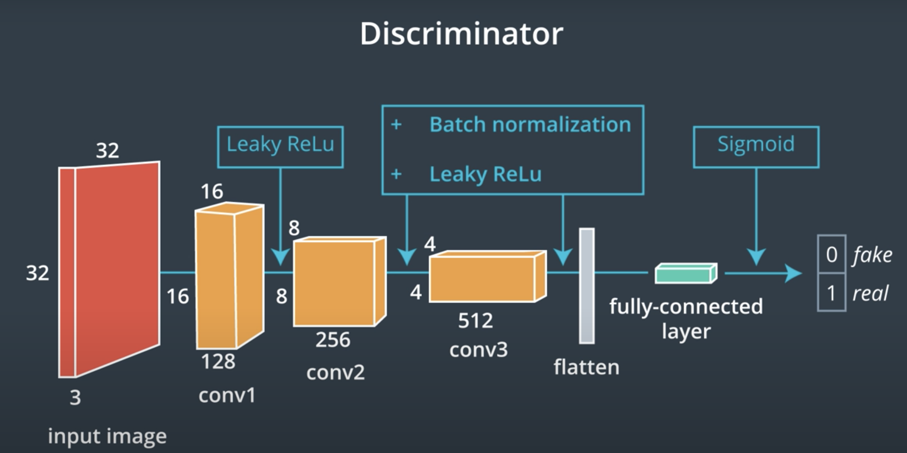
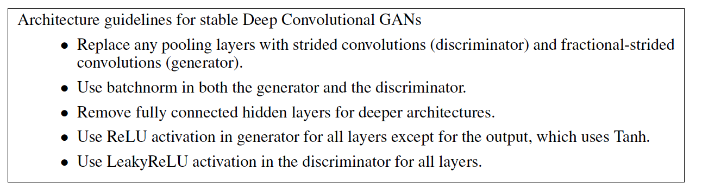
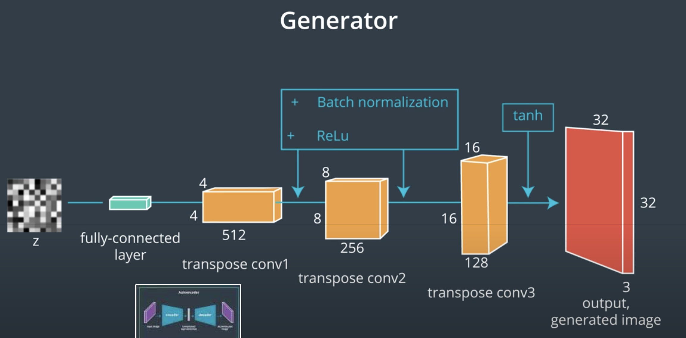
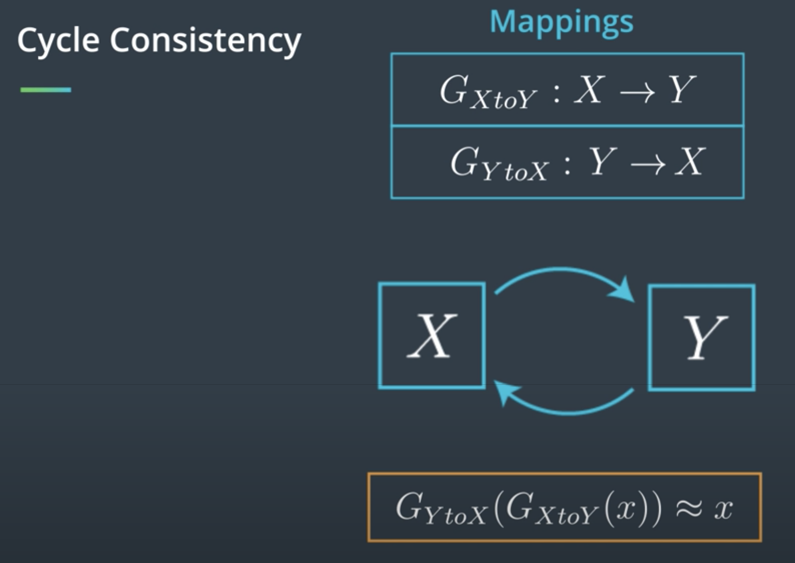
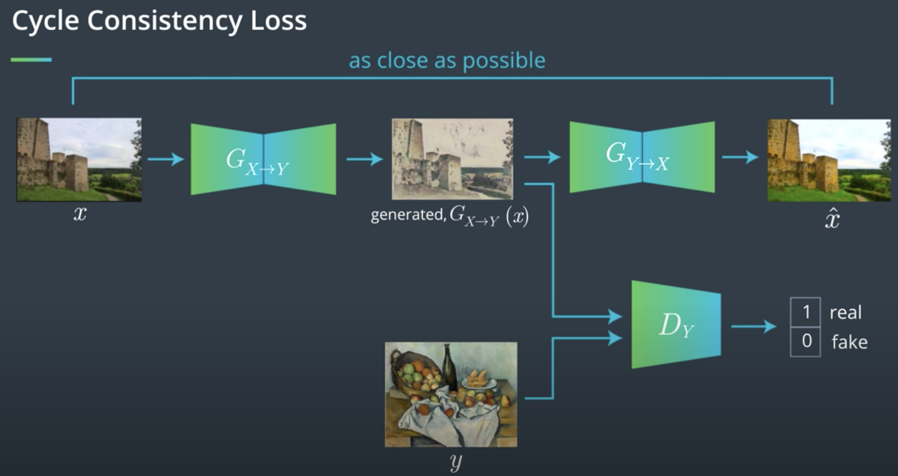
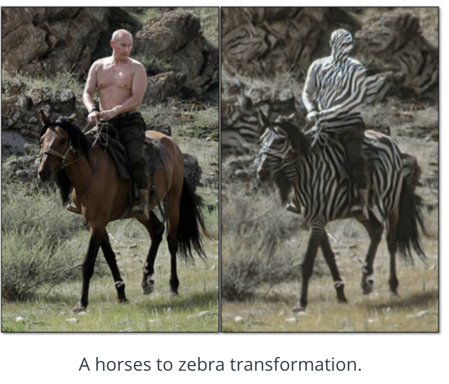

# GAN

The idea behind GANs is that you have two networks, a generator $G$ and a discriminator $D$, competing against each other. The generator makes "fake" data to pass to the discriminator. The discriminator also sees real training data and predicts if the data it's received is real or fake.
> * The generator is trained to fool the discriminator, it wants to output data that looks _as close as possible_ to real, training data.
* The discriminator is a classifier that is trained to figure out which data is real and which is fake.

## Papers
- 2014 paper-[Generative Adversarial Nets](https://arxiv.org/pdf/1406.2661.pdf)
- [2016 Improved Techniques for Training GANs](https://video.udacity-data.com/topher/2018/November/5bea0c6a_improved-training-techniques/improved-training-techniques.pdf)

Here are a few examples to check out:

* [Pix2Pix](https://affinelayer.com/pixsrv/)
* [CycleGAN & Pix2Pix in PyTorch, Jun-Yan Zhu](https://github.com/junyanz/pytorch-CycleGAN-and-pix2pix)
* [A list of generative models](https://github.com/wiseodd/generative-models)

## Applications
- StackGAN realistic image synthesis: https://arxiv.org/abs/1612.03242
- iGAN interactive image generation: https://github.com/junyanz/iGAN
- CartoonGAN: https://video.udacity-data.com/topher/2018/November/5bea23cd_cartoongan/cartoongan.pdf
- You'll learn much more about Pix2Pix and CycleGAN formulations
- [Some cool applications of GAN](https://medium.com/@jonathan_hui/gan-some-cool-applications-of-gans-4c9ecca35900)
- [tulip generation]: The tulip generation model was created by the artist Anna Ridler, and you can read about her data collection method and inspiration in this [article](https://www.fastcompany.com/90237233/this-ai-dreams-in-tulips).

## How it works
Generator: takes random noise as input, run the noise through a differentiable function to reshape it to have recognizable structure. THe output is a realistic image.  The goal is for these images to be fair samples from the distribution over real data.
discriminator: learns to guide the generator. It is shown real data half of the time, and image from generator the other half of the time. 1 to real images, 0 to fake images, Generator tries to generate images that D assign one.

### Equilibria
Equilibria: non player can improve their strategy, given the other player don't change their strategy.
The saddle point: one player's max point & the other player's min point

But we may not able to find the equilibrium. We usually train GAN by running two optimization algorithms simultaneously.
A common failure for GAN is when data contain multiple clusters, then the generator will generate one cluster, and discriminator would learn to reject that cluster as being fake. THen the generator will learn generate another cluster.
We would prefer to have an algorithm that reliably finds the equilibrium where the generator samples from all the clusters simultaneously.
That is the key reserach problem in GAN, designing an algorithm for finding the equilibrium of a game involving high-demensional, continuous, non-convex cost functions

### Improved Training Techniques for GANs

- paper - [Improved Techniques for Training GANs](https://video.udacity-data.com/topher/2018/November/5bea0c6a_improved-training-techniques/improved-training-techniques.pdf)
- [lecture video](https://classroom.udacity.com/nanodegrees/nd101/parts/2ea78ff8-befd-4046-b06e-5327871b0748/modules/72f47c70-f4f0-49f8-a67a-a3562f0bd7ac/lessons/de9a07cd-bfb4-4d09-a305-2f20f158b965/concepts/8aa80681-3cee-421a-af6f-859e8205d11a)

# Deep convolutional GAN
original paper - [UNSUPERVISED REPRESENTATION LEARNING WITH DEEP CONVOLUTIONAL GENERATIVE ADVERSARIAL NETWORKS](https://arxiv.org/pdf/1511.06434.pdf)

## Batch Normalization
original paper - [Batch Normalization: Accelerating Deep Network Training b y Reducing Internal Covariate Shift](https://arxiv.org/pdf/1502.03167.pdf)

- instead of just normalizing the inputs to the network, we normalize the inputs to every layer within the network.
- It's called "batch" normalization because, during training, we normalize each layer's inputs by using the mean and standard deviation (or variance) of the values in the current batch. These are sometimes called the batch statistics.
  - Specifically, batch normalization normalizes the output of a previous layer by subtracting the batch mean and dividing by the batch standard deviation.
  - Why might this help? Well, we know that normalizing the inputs to a network helps the network learn and converge to a solution. However, a network is a series of layers, where the output of one layer becomes the input to another. That means we can think of any layer in a neural network as the first layer of a smaller network.

### Internal Covariate Shift
Beyond the intuitive reasons, there are good mathematical reasons to motivate batch normalization. It helps combat what the authors call internal covariate shift.
- In this case, internal covariate shift refers to the change in the distribution of the inputs to different layers. It turns out that training a network is most efficient when the distribution of inputs to each layer is similar!

Read more in the original paper and  'Chapter 8: Optimization for Training Deep Models' in Deep Learning Book

### Benefits of Batch Normalization
Batch normalization optimizes network training. It has been shown to have several benefits:

By using batch normalization to normalize the inputs at each layer of a network, we can make these inputs more consistent and thus reduce oscillations that may happen in gradient descent calculations. This helps us build deeper models that also converge faster!

1. Networks train faster – Each training iteration will actually be slower because of the extra calculations during the forward pass and the additional hyperparameters to train during back propagation. However, it should converge much more quickly, so training should be faster overall.
2. Allows higher learning rates – Gradient descent usually requires small learning rates for the network to converge. And as networks get deeper, their gradients get smaller during back propagation so they require even more iterations. Using batch normalization allows us to use much higher learning rates, which further increases the speed at which networks train.
4. Makes weights easier to initialize – Weight initialization can be difficult, and it's even more difficult when creating deeper networks. Batch normalization seems to allow us to be much less careful about choosing our initial starting weights.
5. Makes more activation functions viable – Some activation functions do not work well in some situations. Sigmoids lose their gradient pretty quickly, which means they can't be used in deep networks. And ReLUs often die out during training, where they stop learning completely, so we need to be careful about the range of values fed into them. Because batch normalization regulates the values going into each activation function, non-linearlities that don't seem to work well in deep networks actually become viable again.
6.  Simplifies the creation of deeper networks – Because of the first 4 items listed above, it is easier to build and faster to train deeper neural networks when using batch normalization. And it's been shown that deeper networks generally produce better results, so that's great.
7. Provides a bit of regularization – Batch normalization adds a little noise to your network. In some cases, such as in Inception modules, batch normalization has been shown to work as well as dropout. But in general, consider batch normalization as a bit of extra regularization, possibly allowing you to reduce some of the dropout you might add to a network.
8. May give better results overall – Some tests seem to show batch normalization actually improves the training results. However, it's really an optimization to help train faster, so you shouldn't think of it as a way to make your network better. But since it lets you train networks faster, that means you can iterate over more designs more quickly. It also lets you build deeper networks, which are usually better. So when you factor in everything, you're probably going to end up with better results if you build your networks with batch normalization.

### Pytorch
- Layers with batch normalization do not include a bias term.
  - Why no bias?
 The reason there is no bias for our convolutional layers is because we have batch normalization applied to their outputs. The goal of batch normalization is to get outputs with: mean = 0
standard deviation = 1
Since we want the mean to be 0, we do not want to add an offset (bias) that will deviate from 0. We want the outputs of our convolutional layer to rely only on the coefficient weights.
- We use PyTorch's BatchNorm1d function to handle the math. This is the function you use to operate on linear layer outputs; you'll use BatchNorm2d for 2D outputs like filtered images from convolutional layers.
- We add the batch normalization layer before calling the activation function.  so it always goes layer > batch norm > activation.
- Finally, when you tested your model, you set it to .eval() mode, which ensures that the batch normalization layers use the population rather than the batch mean and variance (as they do during training).

Take a look at the PyTorch [BatchNorm2d documentation](https://pytorch.org/docs/stable/nn.html#batchnorm2d) to learn more about how to add batch normalization to a model, and how data is transformed during training (and evaluation).

# BN for other types of network
### ConvNets

Convolution layers consist of multiple feature maps. (Remember, the depth of a convolutional layer refers to its number of feature maps.) And the weights for each feature map are shared across all the inputs that feed into the layer. Because of these differences, batch normalizing convolutional layers requires batch/population mean and variance per feature map rather than per node in the layer.

> To apply batch normalization on the outputs of convolutional layers, we use [BatchNorm2d](https://pytorch.org/docs/stable/nn.html#batchnorm2d)

### RNNs

Batch normalization can work with recurrent neural networks, too, as shown in the 2016 paper [Recurrent Batch Normalization](https://arxiv.org/abs/1603.09025). It's a bit more work to implement, but basically involves calculating the means and variances per time step instead of per layer. You can find an example where someone implemented recurrent batch normalization in PyTorch, in [this GitHub repo](https://github.com/jihunchoi/recurrent-batch-normalization-pytorch).

# Other Interesting Applications of GANs
## Semi-Supervised Learning
Semi-supervised models are used when you only have a few labeled data points. The motivation for this kind of model is that, we increasingly have a lot of raw data, and the task of labelling data is tedious, time-consuming, and often, sensitive to human error. Semi-supervised models give us a way to learn from a large set of data with only a few labels, and they perform surprisingly well even though the amount of labeled data you have is relatively tiny. Ian Goodfellow has put together a video on this top, which you can see, below. https://youtu.be/_LRpHPxZaX0

- [Improved Techniques for Training GANs](https://arxiv.org/abs/1606.03498),  OpenAI achieves <6% error rate on SVHM using only 1000 labeld examples

- Semi-Supervised Learning in PyTorch.m There is a readable implementation of a semi-supervised GAN in this [Github repository](https://github.com/Sleepychord/ImprovedGAN-pytorch).
## Domain Invariance
Consider this car classification example- [Fine-Grained Car Detection for Visual Census Estimation](https://arxiv.org/abs/1709.02480). From the abstract, researchers (Timnit Gebru, et. al) wanted to:
>develop a computer vision pipeline to predict income, per capita carbon emission, crime rates and other city attributes from a single source of publicly available visual data. We first detect cars in 50 million images across 200 of the largest US cities and train a model to predict demographic attributes using the detected cars. To facilitate our work, we have collected the largest and most challenging fine-grained dataset reported to date consisting of over 2600 classes of cars comprised of images from Google Street View and other web sources, classified by car experts to account for even the most subtle of visual differences.

One interesting thing to note is that these researchers obtained some manually-labeled Streetview data and data from other sources. I'll call these image sources, domains. So Streetview is a domain and another source, say cars.com is separate domain.

The researchers then had to find a way to combine what they learned from these multiple sources! They did this with the use of multiple classifiers; adversarial networks that do not include a Generator, just two classifiers.

>One classifier is learning to recognize car types.
And another is learning to classify whether a car image came from Google Streetview or cars.com, given the extracted features from that image

So, the first classier’s job is to classify the car image correctly and to trick the second classifier so that the second classifier cannot tell whether the extracted image features indicate an image from the Streetview or cars.com domain!

The idea is: if the second classifier cannot tell which domain the features are from, then this indicates that these features are shared among the two domains, and you’ve found features that are domain-invariant.

Domain-invariance can be applied to a number of applications in which you want to find features that are invariant between two different domains. These can be image domains or domains based on different population demographics and so on. This is also sometimes referred to as adversarial feature learning - [Controllable Invariance through Adversarial Feature Learning](https://arxiv.org/pdf/1705.11122.pdf)

## 3. Ethical and Artistic Applications: Further Reading
- [Ethical implications of GANs](https://www.newyorker.com/magazine/2018/11/12/in-the-age-of-ai-is-seeing-still-believing) and when "fake" images can give us information about reality.
- [Do Androids Dream in Balenciaga?](https://www.ssense.com/en-us/editorial/fashion/do-androids-dream-of-balenciaga-ss29) note that the author briefly talks about generative models having artistic potential rather than ethical implications, but the two go hand in hand. The generator, in this case, will recreate what it sees on the fashion runway; typically thin, white bodies that do not represent the diversity of people in the world (or even the diversity of people who buy Balenciaga).

# Pix2Pix
- original Pix2Pix paper - [Image-to-Image Translation with Conditional Adversarial Networks](https://arxiv.org/pdf/1611.07004.pdf)
  - related work on creating high-res images: high resolution, conditional GANs - [github](https://github.com/NVIDIA/pix2pixHD)
- image2image demo: https://affinelayer.com/pixsrv/

## Loss function
https://ml-cheatsheet.readthedocs.io/en/latest/loss_functions.html
in GAN, instead of a fixed loss function, it uses another network's output to be used as loss.

## Latent Space
Latent means "hidden" or "concealed". In the context of neural networks, a latent space often means a feature space, and a latent vector is just a compressed, feature-level representation of an image!

For example, when you created a simple autoencoder, the outputs that connected the encoder and decoder portion of a network made up a compressed representation that could also be referred to as a latent vector.

You can read more about latent space in [this blog post] as well as an interesting property of this space: recall that we can mathematically operate on vectors in vector space and with latent vectors, we can perform a kind of feature-level transformation on an image!

This manipulation of latent space has even been used to create an interactive GAN, iGAN for interactive image generation! I recommend reading the paper, linked in the [Github readme](https://github.com/junyanz/iGAN/blob/master/README.md).

# CycleGANs & Unpaired Data
- original paper - [Unpaired Image-to-Image Translation using Cycle-Consistent Adversarial Networks](https://arxiv.org/pdf/1703.10593.pdf)
  - [github](https://github.com/junyanz/pytorch-CycleGAN-and-pix2pix)
- paper - [CycleGAN Face-off](https://arxiv.org/pdf/1712.03451.pdf)

##  A CycleGAN has a few shortcomings:

- It will only show one version of a transformed output even if there are multiple, possible outputs.
- A simple CycleGAN produces low-resolution images, though there is some research around high-resolution GANs: https://github.com/NVIDIA/pix2pixHD
- It occasionally fails! (One such case is pictured below.)

## Beyond CycleGANs
- Augmented CycleGAN - [Augmented CycleGAN: Learning Many-to-Many Mappings from Unpaired Data
](https://arxiv.org/abs/1802.10151) : learns one-to-many mappings, produce multiple different outputs
- paired cycleGAN - [PairedCycleGAN: Asymmetric Style Transfer
for Applying and Removing Makeup](https://adoberesearch.ctlprojects.com/wp-content/uploads/2018/04/CVPR2018_Paper3623_Chang.pdf): apply multiple styles to a given image
- Implementation of [StarGAN github](https://github.com/yunjey/StarGAN) : mapping more than 2 domains
  - paper: [StarGAN: Unified Generative Adversarial Networks for Multi-Domain Image-to-Image Translation](https://arxiv.org/abs/1711.09020)

### Residual Block

To define the generators, you're expected to define a `ResidualBlock` class which will help you connect the encoder and decoder portions of the generators. You might be wondering, what exactly is a Resnet block? It may sound familiar from something like ResNet50 for image classification, pictured below.

ResNet blocks rely on connecting the output of one layer with the input of an earlier layer. The motivation for this structure is as follows: very deep neural networks can be difficult to train. Deeper networks are more likely to have vanishing or exploding gradients and, therefore, have trouble reaching convergence; batch normalization helps with this a bit. However, during training, we often see that deep networks respond with a kind of training degradation. Essentially, the training accuracy stops improving and gets saturated at some point during training. In the worst cases, deep models would see their training accuracy actually worsen over time!

One solution to this problem is to use **Resnet blocks** that allow us to learn so-called *residual functions* as they are applied to layer inputs. You can read more about this proposed architecture in the paper, [Deep Residual Learning for Image Recognition](https://arxiv.org/pdf/1512.03385.pdf) by Kaiming He et. al, and the below image is from that paper.

### Residual Blocks
So far, we've mostly been defining networks as layers that are connected, one-by-one, in sequence, but there are a few other types of connections we can make! The connection that residual blocks make is sometimes called a skip connection. By summing up the output of one layer with the input of a previous layer, we are effectively making a connection between layers that are not in sequence; we are skipping over at least one layer with such a connection, as is indicated by the loop arrow below.

Residual block with a skip connection between an input x and an output.

If you'd like to learn more about residual blocks and especially their effect on ResNet image classification models, I suggest reading this [blog post](https://towardsdatascience.com/an-overview-of-resnet-and-its-variants-5281e2f56035), which details how ResNet (and its variants) work!

### Skip Connections
More generally, skip connections can be made between several layers to combine the inputs of, say, a much earlier layer and a later layer. These connections have been shown to be especially important in image segmentation tasks, in which you need to preserve spatial information over time (even when your input has gone through strided convolutional or pooling layers). One such example, is in this paper on skip connections and their role in medical image segmentation - [The Importance of Skip Connections in Biomedical Image Segmentation](https://arxiv.org/abs/1608.04117)
