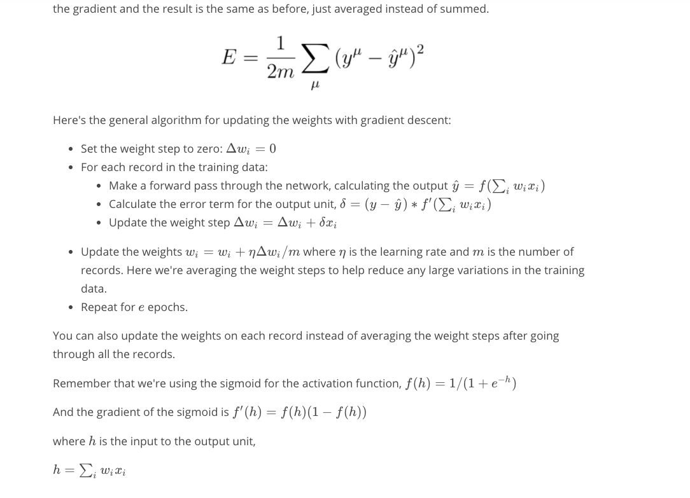

# Neural Networks

## Error function
Needs to be continuous and differentiable. otherwise move tiny step still got 2 errors doesn't help
- cross entropy [Cross Entropy Error with Logistic Activation](https://www.ics.uci.edu/~pjsadows/notes.pdf)
- [Mean squared error](https://en.wikipedia.org/wiki/Mean_squared_error)
## Maximum Likelihood
pick the model that give the existing labels the highest probability.
The probability of all the samples being labeled correct is the product of all probabilities.
But product result is small. sum is easier to deal with.
What function turns products into sums? log(ab) = log(a) + log(b)
- cross entropy: the log of probability of the predictor resulting in the label. lower entropy meaning higher probability that label would be predicted.
- multi-class cross entropy
## Gradient descend
Gradient is another term for rate of change or slope. If you need to brush up on this concept, check out [Khan Academy's great lectures](https://www.khanacademy.org/math/multivariable-calculus/multivariable-derivatives/gradient-and-directional-derivatives/v/gradient) on the topic.

- Since the weights will just go wherever the gradient takes them, they can end up where the error is low, but not the lowest. These spots are called local minima. If the weights are initialized with the wrong values, gradient descent could lead the weights into a local minimum, illustrated below.
- [Momentum](https://distill.pub/2017/momentum/) will avoid this
- sum of squared errors(SSE)
- [multi-variable calculus](https://www.khanacademy.org/math/multivariable-calculus)
- backprop:
  -From Andrej Karpathy: [Yes, you should understand backprop](https://medium.com/@karpathy/yes-you-should-understand-backprop-e2f06eab496b#.vt3ax2kg9)
  - Also from Andrej Karpathy, [a lecture from Stanford's CS231n course](https://www.youtube.com/watch?v=59Hbtz7XgjM)

### MSE Gradient Descent Implementation

