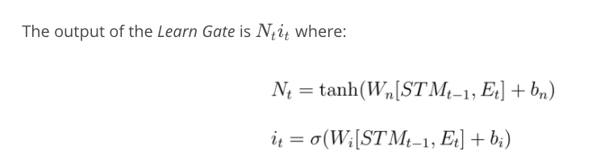
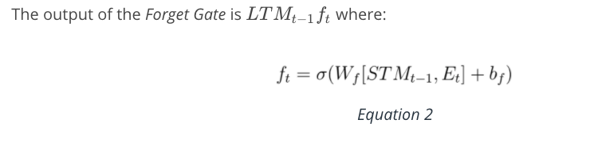
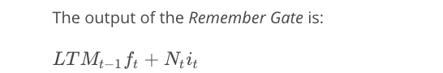
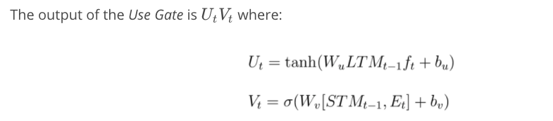
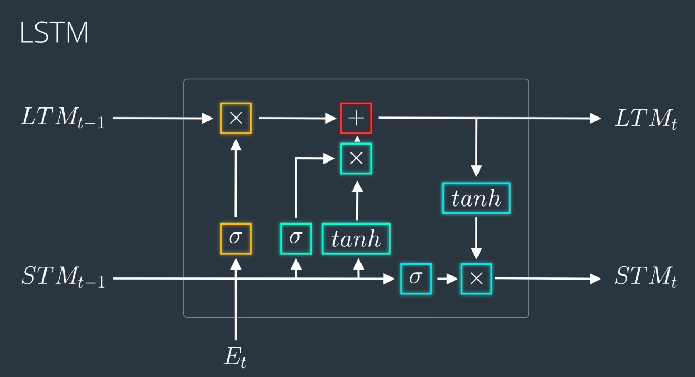
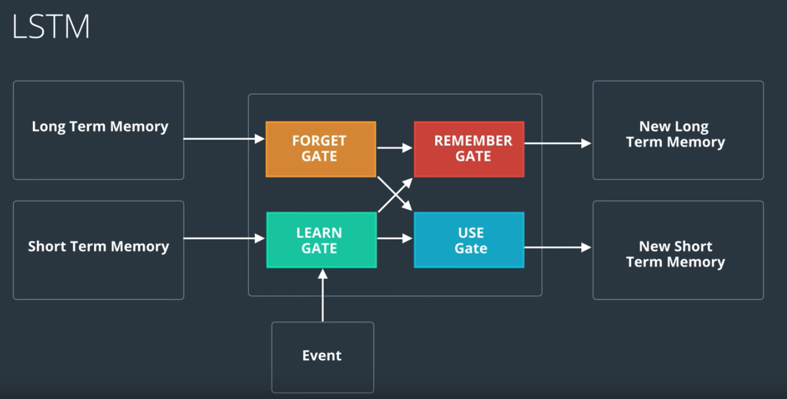
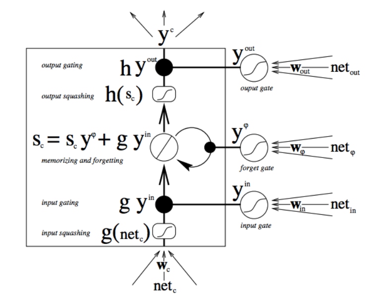

# LSTM
## Notebook
- [Simple_RNN.ipynb](https://github.com/udacity/deep-learning-v2-pytorch/blob/master/recurrent-neural-networks/time-series/Simple_RNN.ipynb)

## papers
- [LSTM: A Search Space Odyssey](https://arxiv.org/abs/1503.04069)
- [An Empirical Exploration of Recurrent Network Architectures](http://proceedings.mlr.press/v37/jozefowicz15.pdf)

## Other Architectures
GRUs can be found in the following links: [Michael Guerzhoy's post](http://www.cs.toronto.edu/~guerzhoy/321/lec/W09/rnn_gated.pdf)

## how it works
- Learn Gate: short term memeory + event , then ignore to keep important parts:

- forget gate: take long term memory and decide which part to keep and forget. forget science and keep the fact that it's about nature.

- remember gate: take output from learn & forget gate to add them

- use gate: take longterm memoery(from forget gate) and short term memory(learn gate), came out a new short term memoery

put it all together:

LSTMs are explicitly designed to avoid the long-term dependency problem. Remembering information for long periods of time is practically their default behavior, not something they struggle to learn!

not all LSTMs are the same as the above. In fact, it seems like almost every paper involving LSTMs uses a slightly different version. The differences are minor, but it’s worth mentioning some of them.

One popular LSTM variant, introduced by [Gers & Schmidhuber (2000)](ftp://ftp.idsia.ch/pub/juergen/TimeCount-IJCNN2000.pdf), is adding “peephole connections.” This means that we let the gate layers look at the cell state.

- Longer Memories through LSTMs.
Let's think about how our model updates its knowledge of the world. So far, we've placed no constraints on this update, so its knowledge can change pretty chaotically: at one frame it thinks the characters are in the US, at the next frame it sees the characters eating sushi and thinks they're in Japan, and at the next frame it sees polar bears and thinks they're on Hydra Island. Or perhaps it has a wealth of information to suggest that Alice is an investment analyst, but decides she's a professional assassin after seeing her cook.

This chaos means information quickly transforms and vanishes, and it's difficult for the model to keep a long-term memory. So what we'd like is for the network to learn how to update its beliefs (scenes without Bob shouldn't change Bob-related information, scenes with Alice should focus on gathering details about her), in a way that its knowledge of the world evolves more gently.

- This is how we do it.

Adding a forgetting mechanism. If a scene ends, for example, the model should forget the current scene location, the time of day, and reset any scene-specific information; however, if a character dies in the scene, it should continue remembering that he's no longer alive. Thus, we want the model to learn a separate forgetting/remembering mechanism: when new inputs come in, it needs to know which beliefs to keep or throw away.
Adding a saving mechanism. When the model sees a new image, it needs to learn whether any information about the image is worth using and saving. Maybe your mom sent you an article about the Kardashians, but who cares?
So when new a input comes in, the model first forgets any long-term information it decides it no longer needs. Then it learns which parts of the new input are worth using, and saves them into its long-term memory.
Focusing long-term memory into working memory. Finally, the model needs to learn which parts of its long-term memory are immediately useful. For example, Bob's age may be a useful piece of information to keep in the long term (children are more likely to be crawling, adults are more likely to be working), but is probably irrelevant if he's not in the current scene. So instead of using the full long-term memory all the time, it learns which parts to focus on instead.
This, then, is an long short-term memory network. Whereas an RNN can overwrite its memory at each time step in a fairly uncontrolled fashion, an LSTM transforms its memory in a very precise way: by using specific learning mechanisms for which pieces of information to remember, which to update, and which to pay attention to. This helps it keep track of information over longer periods of time.

## TODO
1. don't quite understand lstm 2.10 quiz
2. read about LSTM paper/posts
3. read about other architectures
4. why LSTM not having vanishing gradient?

## readings
- [Orginal Paper](http://www.bioinf.jku.at/publications/older/2604.pdf)
- [Andrej Karpathy's lecture on RNNs and LSTMs from CS231](https://www.youtube.com/watch?v=iX5V1WpxxkY)
- [Understanding LSTM Networks](http://colah.github.io/posts/2015-08-Understanding-LSTMs/)
- [Exploring LSTMs](http://blog.echen.me/2017/05/30/exploring-lstms/)
- [The Unreasonable Effectiveness of Recurrent Neural Networks](http://karpathy.github.io/2015/05/21/rnn-effectiveness/)
