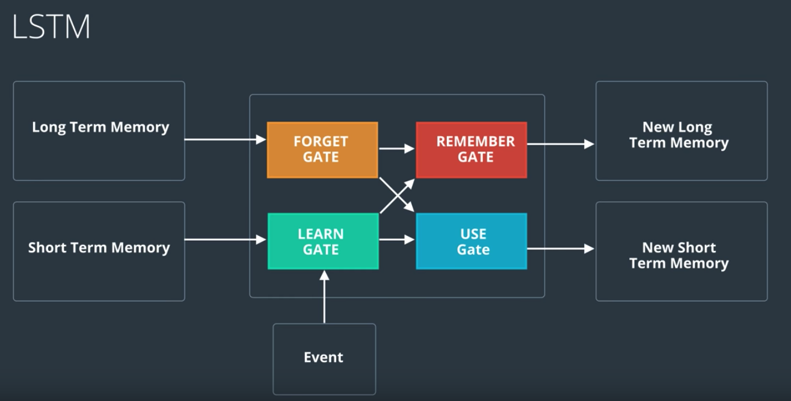

# LSTM

## readings
- [Andrej Karpathy's lecture on RNNs and LSTMs from CS231](https://www.youtube.com/watch?v=iX5V1WpxxkY)
- [Understanding LSTM Networks](http://colah.github.io/posts/2015-08-Understanding-LSTMs/)
- [Exploring LSTMs](http://blog.echen.me/2017/05/30/exploring-lstms/)

## how it works
- Learn Gate: short term memeory + event , then ignore to keep important parts:

- forget gate: take long term memory and decide which part to keep and forget. forget science and keep the fact that it's about nature.

- remember gate: take output from learn & forget gate to add them

- use gate: take longterm memoery(from forget gate) and short term memory(learn gate), came out a new short term memoery

put it all together:

