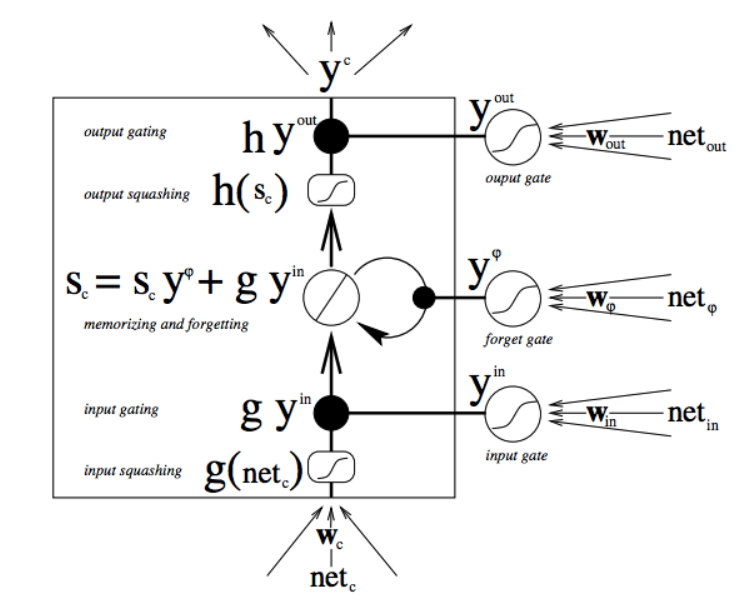

# RNN
## Readings

- [The Unreasonable Effectiveness of Recurrent Neural Networks](http://karpathy.github.io/2015/05/21/rnn-effectiveness/)

## Application
- RNN's can be used to generate text given any other data. For example, you can give an RNN a feature vector from an image, and use it to [generate a descriptive caption](https://github.com/yunjey/pytorch-tutorial/tree/master/tutorials/03-advanced/image_captioning). Image captions are used to create accessible content and in a number of cases where one may want to read about the contents of an image.
- RNN's is in generating drawings. Sketch RNN [demo](https://magenta.tensorflow.org/assets/sketch_rnn_demo/index.html) is a program that learns to complete a drawing, once you give it something (a line or circle, etc.) to start!
- industry applications:
  - speech recognition. e.g alexa, siri
  - time series prediction.
    - e.g predict traffic patterns to optimize driving path.(waze)
  - predict movie selection, what movie to watch next(netflix).
  - predict stock movement and other market conditions that change over time (most quatitive hedge funds).
  - natural language procession (NLP). machine translation by google .  question answering like google analytics. chatbots
  - gesture recognition. observe a sequence of video frames to determine which gesture the use has made.
  - Are you into gaming and bots? Check out the [DotA 2 bot by Open AI](https://openai.com/blog/dota-2/)
  - How about automatically adding sounds to [silent movies](https://www.youtube.com/watch?time_continue=1&v=0FW99AQmMc8)?
  - Here is a cool tool for automatic [handwriting generation](http://www.cs.toronto.edu/~graves/handwriting.cgi?text=My+name+is+Luka&style=&bias=0.15&samples=3)
  - Amazon's voice to text using high quality speech recognition, [Amazon Lex](https://aws.amazon.com/lex/faqs/).
  - Facebook uses RNN and LSTM technologies for [building language models](https://engineering.fb.com/ml-applications/building-an-efficient-neural-language-model-over-a-billion-words/)
  - Netflix also uses RNN models - [SESSION-BASED RECOMMENDATIONS WITH RECURRENT NEURAL NETWORKS](https://arxiv.org/pdf/1511.06939.pdf)

## why RNN?
- temporal dependencies
The neural network architectures you've seen so far were trained using the current inputs only. We did not consider previous inputs when generating the current output. In other words, our systems did not have any memory elements. RNNs address this very basic and important issue by using memory (i.e. past inputs to the network) when producing the current output.

## key flaw
RNNs have a key flaw, as capturing relationships that span more than 8 or 10 steps back is practically impossible. This flaw stems from the "vanishing gradient" problem in which the contribution of information decays geometrically over time.What does this mean?
As you may recall, while training our network we use backpropagation. In the backpropagation process we adjust our weight matrices with the use of a gradient. In the process, gradients are calculated by continuous multiplications of derivatives. The value of these derivatives may be so small, that these continuous multiplications may cause the gradient to practically "vanish".
- [Vanishing gradient problem](https://en.wikipedia.org/wiki/Vanishing_gradient_problem). The problem is that in some cases, the gradient will be vanishingly small, effectively preventing the weight from changing its value. In the worst case, this may completely stop the neural network from further training.
- [Geometric Sequences and Exponential Functions](https://socratic.org/algebra/exponents-and-exponential-functions/geometric-sequences-and-exponential-functions)
- LSTM is one option to overcome the Vanishing Gradient problem in RNNs.  Long Short-Term Memory Cells (LSTMs) and Gated Recurrent Units (GRUs) give a solution to the vanishing gradient problem, by helping us apply networks that have temporal dependencies. In this lesson we will focus on RNNs and continue with LSTMs. We will not be focusing on GRUs. More information about GRUs can be found in the following [blog](https://deeplearning4j.org/). Focus on the overview titled: GRUs.
- important milestones in RNN:
  - [TDNN](https://en.wikipedia.org/wiki/Time_delay_neural_network)
  - Here is the original [Elman Network publication](https://onlinelibrary.wiley.com/doi/abs/10.1207/s15516709cog1402_1) from 1990. This link is provided here as it's a significant milestone in the world on RNNs. To simplify things a bit, you can take a look at the following [additional info](https://en.wikipedia.org/wiki/Recurrent_neural_network#Elman_networks_and_Jordan_networks).
  - In this [LSTM link](http://www.bioinf.jku.at/publications/older/2604.pdf) you will find the original paper

## How it works
There are two main differences between FFNNs and RNNs. The Recurrent Neural Network uses:
- sequences as inputs in the training phase, and
- memory elements

Memory is defined as the output of hidden layer neurons, which will serve as additional input to the network during next training step.The basic three layer neural network with feedback that serve as memory inputs is called the Elman Network

THe states input is the hidden layer from previous time step(s):
In RNNs the state layer depended on the current inputs, their corresponding weights, the activation function and also on the previous state:

The output vector is calculated exactly the same as in FFNNs. It can be a linear combination of the inputs to each output node with the corresponding weight matrix W_yW
y
​	 , or a softmax function of the same linear combination.
lesson 1.13, RNN part b

### Backpropagation Through Time (BPTT

  in RNNs the current state depends on the input as well as the previous states, with the use of an activation function.
  

In the case of a single hidden (state) layer, we will have three weight matrices to consider. Here we use the following notations:

- W_x- represents the weight matrix connecting the inputs to the state layer.
- W_y - represents the weight matrix connecting the state to the output.
- W_s- represents the weight matrix connecting the state from the previous timestep to the state in the following timestep.

we used Backpropagation Through Time (BPTT) where we accumulate all of the contributions from previous timesteps.

When training RNNs using BPTT, we can choose to use mini-batches, where we update the weights in batches periodically (as opposed to once every inputs sample). We calculate the gradient for each step but do not update the weights right away. Instead, we update the weights once every fixed number of steps. This helps reduce the complexity of the training process and helps remove noise from the weight updates.

The following is the equation used for Mini-Batch Training Using Gradient Descent: (where \delta_{ij}δ
ij
​	  represents the gradient calculated once every inputs sample and M represents the number of gradients we accumulate in the process).

If we backpropagate more than ~10 timesteps, the gradient will become too small. This phenomena is known as the vanishing gradient problem where the contribution of information decays geometrically over time. Therefore temporal dependencies that span many time steps will effectively be discarded by the network. Long Short-Term Memory (LSTM) cells were designed to specifically solve this problem.

In RNNs we can also have the opposite problem, called the exploding gradient problem, in which the value of the gradient grows uncontrollably. A simple solution for the exploding gradient problem is Gradient Clipping - [On the difficulty of training Recurrent Neural Networks](https://arxiv.org/abs/1211.5063). You can concentrate on Algorithm 1 which describes the gradient clipping idea in simplicity.

# LSTM
[Paper](http://www.bioinf.jku.at/publications/older/2604.pdf)
This is a single neuron in RNN.
If we take a close look at the RNN neuron, we can see that we have simple linear combinations (with or without the use of an activation function). We can also see that we have a single addition.

THis is LSTM Cell. The LSTM cell allows a recurrent system to learn over many time steps without the fear of losing information due to the vanishing gradient problem. It is fully differentiable, therefore gives us the option of easily using backpropagation when updating the weights.

