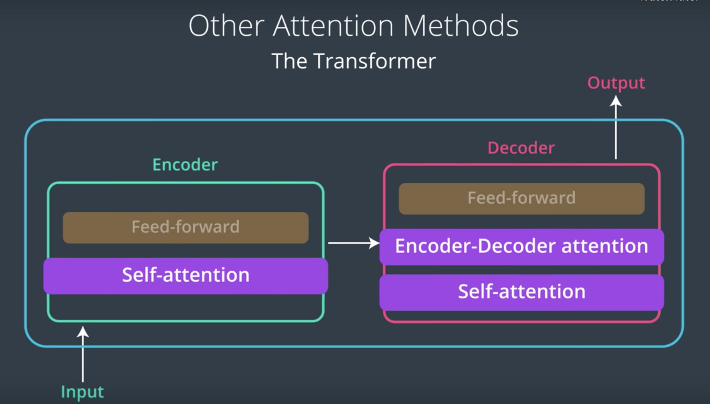
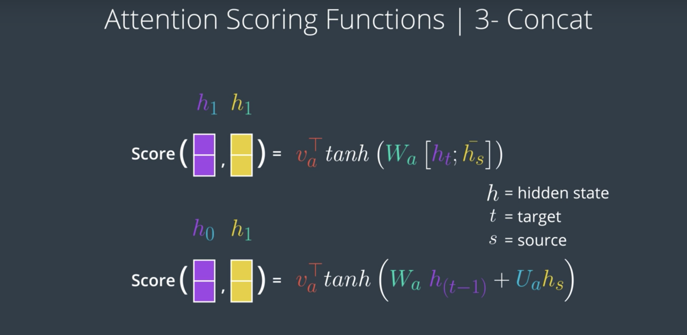

# Attention
Attention is a mechanism combined in the RNN allowing it to focus on certain parts of the input sequence when predicting a certain part of the output sequence, enabling easier learning and of higher quality.

## recent development

- Paper: [Attention Is All You Need](https://arxiv.org/abs/1706.03762)

- Talk: [Attention is all you need attentional neural network models](https://www.youtube.com/watch?v=rBCqOTEfxvg) – Łukasz Kaiser

no RNN, only attention

- 1/16  [Long Short-Term Memory-Networks for Machine Reading](https://arxiv.org/abs/1601.06733)

## Encoders and Decoders
- sequence to sequence models, using encoder & decoder
- The encoder and decoder do not have to be RNNs; they can be CNNs too!
 In computer vision, we can use this kind of encoder-decoder model to generate words or captions for an input image or even to generate an image from a sequence of input words. For now know that we can input an image into a CNN (encoder) and generate a descriptive caption for that image using an LSTM (decoder).

- encoder gives all vectors to decoder, decoder learns a context matrix to decide on the attentions (attentions can also be used to learn the order in different language translation)

- What's a more reasonable embedding size for a real-world application? 200-300

## scoring functions

- [Neural Machine Translation by Jointly Learning to Align and Translate](https://arxiv.org/abs/1409.0473)

- [Effective Approaches to Attention-based Neural Machine Translation](https://arxiv.org/abs/1508.04025)

- [medium article](https://medium.com/datadriveninvestor/attention-in-rnns-321fbcd64f05)

## The context vectors
The context vectors enable the decoder to focus on certain parts of the input when predicting its output. Each context vector is a weighted sum of the encoder’s output vectors h1, h2, h3, h4, each vector hi contains information about the whole input sequence (since it has access to the encoder states during its computation) with a strong focus on the parts surrounding the i-th vector of the input sequence. The vectors h1, h2, h3, h4 are scaled by weights ɑij capturing the degree of relevance of input xj to output at time i, yi.

### attention weights
The attention weights αij reflect the importance of hj with respect to the previous hidden state si−1 in deciding the next state si and generating yi. A large αij attention weight causes the RNN to focus on input xj (represented by the encoder’s output hj), when predicting the output yi.

The fc network is trained along with the encoder and decoder using backpropagation, the RNN’s prediction error terms are backpropagated backward through the decoder, then through the fc attention network and from there to the encoder.

The most important distinguishing feature of this approach from the basic encoder–decoder is that it does not attempt to encode a whole input sentence into a single fixed-length vector. Instead, it encodes the input sentence into a sequence of vectors and chooses a subset of these vectors adaptively while decoding the translation. This frees a neural translation model from having to squash all the information of a source sentence, regardless of its length, into a fixed-length vector. We show this allows a model to cope better with long sentences.

### comparison of attention scoring functions
- in two papers:

- how many valid scoring methods for attention?
  - concat/additive, dot product, general
- What's the intuition behind using dot product as a scoring method?
  - The dot product of two vectors in word-embedding space is a measure of similarity between them

## Computer vision applications using attention

- Show, Attend and Tell: Neural Image Caption Generation with Visual Attention [pdf](https://arxiv.org/pdf/1502.03044.pdf)

- Bottom-Up and Top-Down Attention for Image Captioning and Visual Question Answering [pdf](https://arxiv.org/pdf/1707.07998.pdf)

- Video Paragraph Captioning Using Hierarchical Recurrent Neural Networks [pdf](https://www.cv-foundation.org/openaccess/content_cvpr_2016/app/S19-04.pdf)

- Every Moment Counts: Dense Detailed Labeling of Actions in Complex Videos [pdf](https://arxiv.org/pdf/1507.05738.pdf)

Tips and Tricks for Visual Question Answering: Learnings from the 2017 Challenge [pdf](https://arxiv.org/pdf/1708.02711.pdf)

Visual Question Answering: A Survey of Methods and Datasets [pdf](https://arxiv.org/pdf/1607.05910.pdf)
