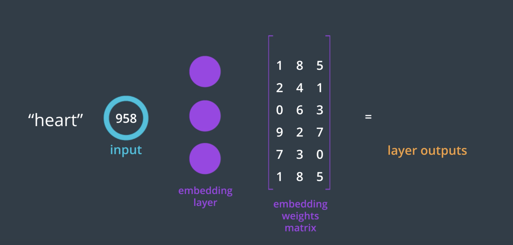

# Embedding
## questions
1. why skip-gram works better than CBOW?
2. what does better mean? In what problem? how to prove it is better

## embedding lookup
instead of using one-hot encoding for a word, we can give an input of single number and look it up in the embedding table to find the weights vector.

## word2vec
Word2vec is a group of related models that are used to produce word embeddings. These models are shallow, two-layer neural networks that are trained to reconstruct linguistic contexts of words. Word2vec takes as its input a large corpus of text and produces a vector space, typically of several hundred dimensions, with each unique word in the corpus being assigned a corresponding vector in the space. Word vectors are positioned in the vector space such that words that share common contexts in the corpus are located close to one another in the space

In the continuous bag-of-words architecture, the model predicts the current word from a window of surrounding context words. The order of context words does not influence prediction (bag-of-words assumption). In the continuous skip-gram architecture, the model uses the current word to predict the surrounding window of context words. The skip-gram architecture weighs nearby context words more heavily than more distant context words.

[Word2Vec Tutorial - The Skip-Gram Model](http://mccormickml.com/2016/04/19/word2vec-tutorial-the-skip-gram-model/)

some processing in word2vec worth noticing;
- preprocessing: removes all words that show up five or fewer times in the dataset. This will greatly reduce issues due to noise in the data and improve the quality of the vector representations.
- Words that show up often such as "the", "of", and "for" don't provide much context to the nearby words. If we discard some of them, we can remove some of the noise from our data and in return get faster training and better representations. This process is called subsampling by Mikolov. For each word  𝑤𝑖  in the training set, we'll discard it with probability given by
$$ P(w_i) = 1 - \sqrt{\frac{t}{f(w_i)}} $$
-

### Skip_Grams_Exercise Notebook
Trying to one-hot encode these words is massively inefficient because most values in a one-hot vector will be set to zero. So, the matrix multiplication that happens in between a one-hot input vector and a first, hidden layer will result in mostly zero-valued hidden outputs.

To solve this problem and greatly increase the efficiency of our networks, we use what are called embeddings. Embeddings are just a fully connected layer like you've seen before. We call this layer the embedding layer and the weights are embedding weights. We skip the multiplication into the embedding layer by instead directly grabbing the hidden layer values from the weight matrix. We can do this because the multiplication of a one-hot encoded vector with a matrix returns the row of the matrix corresponding the index of the "on" input unit.
  - Instead of doing the matrix multiplication, we use the weight matrix as a lookup table. We encode the words as integers, for example "heart" is encoded as 958, "mind" as 18094. Then to get hidden layer values for "heart", you just take the 958th row of the embedding matrix. This process is called an embedding lookup and the number of hidden units is the embedding dimension.
  - There is nothing magical going on here. The embedding lookup table is just a weight matrix. The embedding layer is just a hidden layer. The lookup is just a shortcut for the matrix multiplication. The lookup table is trained just like any weight matrix.

## Papers

### [G.E. Hinton, J.L. McClelland, D.E. Rumelhart. Distributed representations](http://www.cs.toronto.edu/~hinton/absps/pdp3.pdf).

 From Parallel distributed processing: Explorations in the microstructure of cognition. Volume I. Cambridge, MA: MIT Press. (https://web.stanford.edu/~jlmcc/papers/)

 - local representation: given a network of simple computing elements and some entities to be represented, the most straightforward schema is to use one computing element for each entity.
 - distributed representation: each entity is represented by a pattern of activity distributed over many computing elements, and each computing element is involed in representing many different entities.
 - virtues of distributed representations:
  1. constructive character: if we view memory as a process that construct a pattern of activity which represents the most plausible item that is consistent with the given cues, wee need some gaurantee that it will converge on the representation of the item that best fit the description, though it may be tolerable to sometimes get a good but not optimal fit. Distributed representations provide an efficient way of using parallel hardware to implement best-fit search. Different items corresponde to different patterns of activity over the same group of hardware units. A partial description is presented in the partial activity pattern, activating some of the hardware units. Interactions between units allow the set of active units to influence others of the units, thereby completing the pattern , and generating the item that best fits the description. A new item is 'stored' by modifying the interaction between the hardware units so as to create new stable pattern of activity.  THe main difference from a conventional computer memory is that patterns which are not active do not exist anywhere. they can be recreated because the connection strengths between units have been changed appropiately , but each connection strength is involved in storing many patterns, so it is impossible to point to a particular place where the memory for a particular item is stored
  2. ability to generalize to novel situations:  when a new item is stored, the modifications in the connection strength must not wipe out existing items. This can be achieved by modifying a very large number of weights very slightly.The new knowledge about chimpanzees is incorporated by modifying some of the connection strength so as to alter the causal effects of the distributed pattern of activity that represents chimpanzees. THe modifications automatically change the causal effects of all similar activity patterns. So if the representation of gorillas is a similar activity pattern over the same set of units, its causal effects will be changed in a similar way
  The very implese distributed schema would represent the conectp of onion and the concept of chimpazee by alternative activity patterns over the very same set of units. It would then be hard to represent chimps and onions at the same time. This problem can be solved by using separate models for each possible role of an item within a larger structure
  3. tunability to chaning enviroment:

### [1st paper - Efficient Estimation of Word Representations in Vector Space](https://video.udacity-data.com/topher/2018/October/5bc56d28_word2vec-mikolov/word2vec-mikolov.pdf)

### [improvements - Distributed Representations of Words and Phrases and their Compositionality](https://video.udacity-data.com/topher/2018/October/5bc56da8_distributed-representations-mikolov2/distributed-representations-mikolov2.pdf)

- A neural probabilistic language model
- Empirical Evaluation and Combination of Advanced Language Modeling Techniques
- [Linguistic Regularities in Continuous Space Word Representations](https://www.aclweb.org/anthology/N13-1090.pdf)
