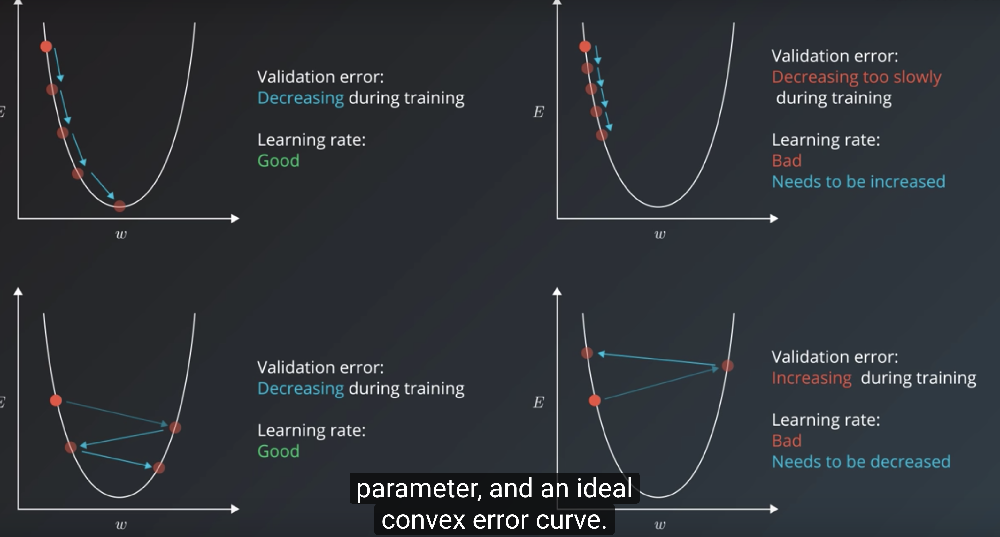
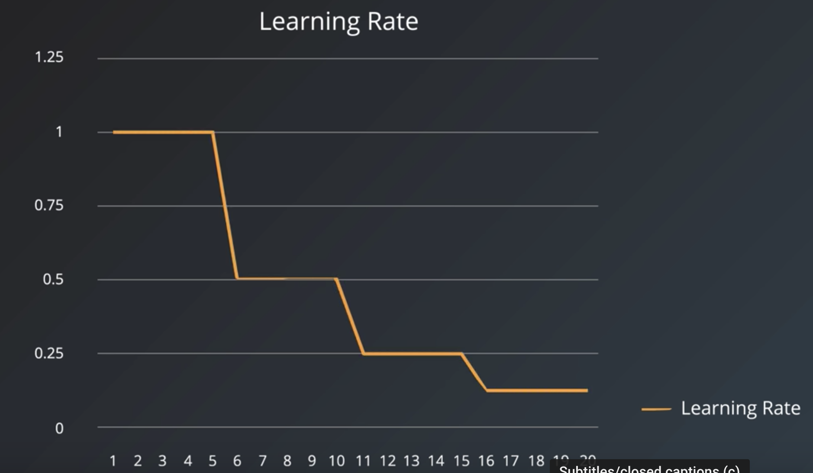
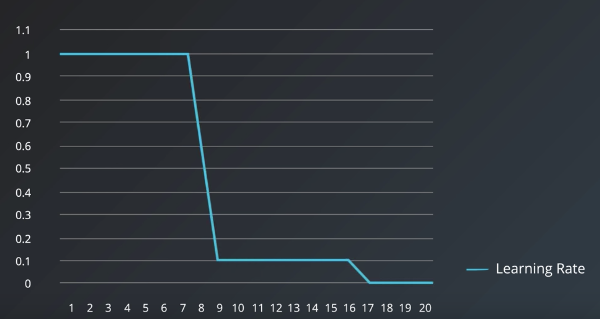

# Learning Rate

## Learning Rate Decay
- linear: e.g decrease by half every 5 epochs.

- [exponential](https://www.tensorflow.org/api_docs/python/tf/compat/v1/train/exponential_decay): e.g multiple by 0.1 every 8 epochs

## Adaptive Learning Optimizers
- [AdamOptimizer](https://www.tensorflow.org/api_docs/python/tf/compat/v1/train/AdamOptimizer)
- [AdagradOptimize](https://www.tensorflow.org/api_docs/python/tf/compat/v1/train/AdagradOptimizer)

# Mini batch size
- [Systematic evaluation of CNN advances on the ImageNet](https://arxiv.org/abs/1606.02228):
  - shows with same learning rate for CNN(lr=0.01), the larger the batch size, the accuracy of the model decrease.
  - if adjust the larning rate as batch size increase(lr=0.01 x batch_size /256), the accuracy does decrease but slightly

- summary: minibatch too small can be too slow, too large result in computational taxing and could result in worse accuracy

- online(stochastic) training: size 1
- batch training: all
- size of minibatch: 1,2,4,8...32...256  . 32 can be a good candidate
  - larger size allows computational boost that utilizes matrix multiplication, but need more memory, outofmemoery errors.
  - small size has noise in error calculations, this noise is helpful preventing training proccess stoping in local minimal

# number of training iterations （epoch）
when to stop training iterations? early stopping:
- monitor the validation error and stop training when it stops decreasing.
- stopping trigger: validation error move back and forth, instead of stopping immediately, stop when the validation error has not improved for the last 10, 20 steps

# number of hidden units/layers
 It needs enouhg capacity.  but if too much, it will overfit(traing accuracy> validation) and try to memoryze the training set, reduce training unit or using regularization.
 - start with enough units, if the model is not learning(training error high), add more hidden units and track validation error, keep adding hidden units util the validation errro is getting worse.
 - a heuristic for the first hidden layer: setting it to a number larger than the number of inputs has been observed benefial
 - number of layers: in practice it is often the case that 3-layer neural networks will outperform 2-layer nets, but going even deeper (4,5,6-layer) rarely helps much more. This is in stark contrast to Convolutional Networks, where depth has been found to be an extremely important component for a good recognition system (e.g. on order of 10 learnable layers)." ~ Andrej Karpathy in https://cs231n.github.io/neural-networks-1/
